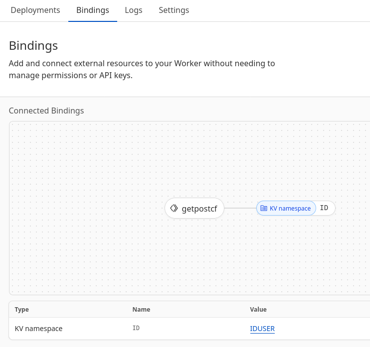

Ok.
твое хранилище кей велью. по адресу деплоя.
Через пост сохраняет кей/велью, через гет отадет значения.

пустой запрос и "/"Б,  отдает страницу index.html

In Wrangler.jsonc

	 "kv_namespaces":[

    {
      "binding": "Name_inName-(ID)",
      "id": "id_in_Value(Not IDUSER name- need id)"
    }]
  
  
  

